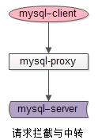

# 程序解释
主要功能由dba.py程序实现，其主要功能就是提供一个main类
* 初始化之后会去连接数据库
* 提供dosql接口，可以进行数据库查询

# 中间件
[解释](https://cloud.tencent.com/developer/article/1047570#:~:text=mysql%2Dproxy%E6%98%AFmysql%E5%AE%98%E6%96%B9,%E8%BF%81%E7%A7%BB%E8%87%B3mysql%2Dproxy%E4%B8%8A%E3%80%82)

mysql-proxy作为client和server之间的中间件，上游可以接入若干个mysql-client
，后端可以连接若干个mysql-server，主要功能是作为一个请求拦截，请求中转的中间层

|--mysqlproxy.lua
|--mysqlproxy_monitor.lua
# py class

* dba.py -- the db helper
    * config: gbase.tmp and dba.tmp

# one off

```
corp\ -- pys for o_corp
    dba_agent.py
    dba_area.py
    dba_assure.py
    ...
csvgz\ -- pys for tbls/cols backup/restore
    dba_from_csvgz.py
    dba_to_csvgz.py
dba_clear_tmp.py -- clear tmp_% manually
```

# daily

```
stepX_*.py:
    remote data pre-processing (mostly the group/order)
```

# report

```
reports\
```


# lab

# tools

```
* mysqlproxy.sh -- to start a mysql-proxy to expose port 5258 of gbase (for quicker dev)
    *.lua
```

